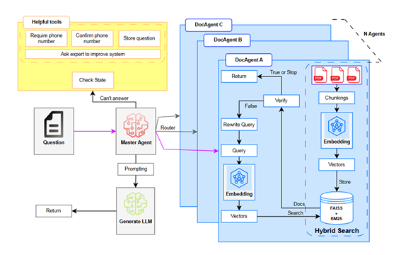

# IT-Sup (IT Student Support Chatbot)

# Introduction

- This is the graduation project of Ho Chi Minh City University of Technology and Education.
- It aims to build a chatbot for IT student using Agentic RAG.
- Using Large Language Models (Qwen and Gemini) with Speech processing technology
- Applying Agentic RAG
- Deploy on Web and Mobile applications
- Survey and Evaluation

# Architecture

- Agentic RAG is deployed on Kaggle, which offers free GPUs weekly (great for personal projects without any fees). We deploy an API endpoint by Flask and open port by Ngrok Tunnel.
- At local, we have Web Application (HTML/CSS, JS with Flask) and Mobile Application (React Native)
- Users can use keyboard or voice to interact the application 

# Agentic RAG flow

This system utilizes a Master Agent to route user questions to the most appropriate agents for processing:

1. User submits a question → The Master Agent analyzes and routes it to a suitable DocAgent.
2. DocAgents (A, B, C, ...):

- Generate vector embeddings for the query.
- Perform Hybrid Search (FAISS + BM25) over document chunks.
- If relevant documents are found, fallback to a Large Language Model (LLM) to generate a response.
- If not, attempt to rewrite the query and search again.
- Stop if verification is successful or no useful result is found.

3. If no agent can answer:

- The Master Agent activates Helpful Tools (e.g., request/confirm phone number, store the question, or escalate to a human expert).

4. Final answer is returned to the user.

# Interfaces

- Mobile Application:

- Web Application:

# Evaluation

- Comparing Qwen and Gemini (API)

- Practical implementation with 30 students at HCMUTE

